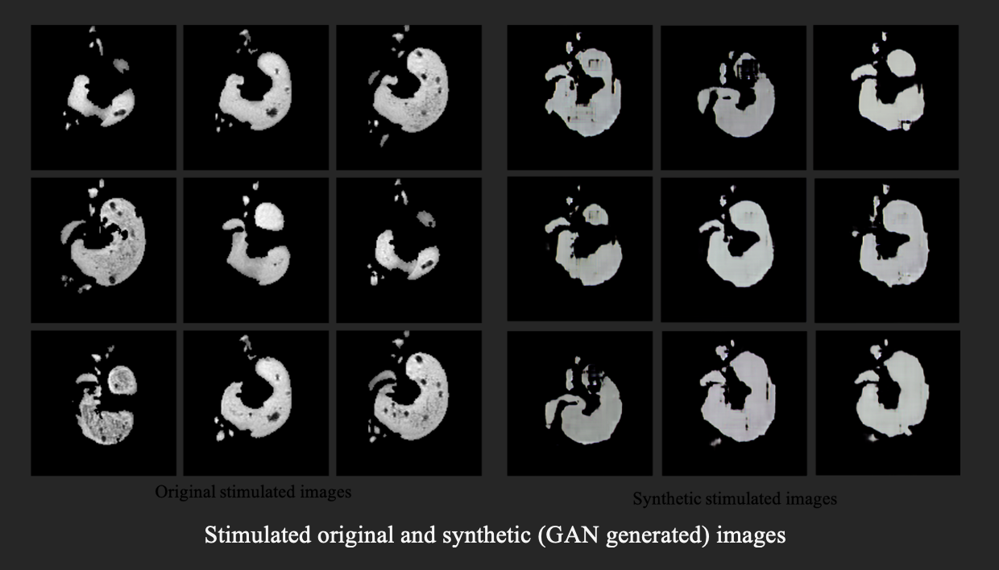

# GI-Segmentation-SU24

Manuscript in Progress

Graduate Research: Emory CS 598R Rotation Project, advised by Dr Babak Mahmoudi, Summer 2024, PhD Year 1

See Documents>Final Report for context. 

----------------  Use as .ipynb or .py ----------------

If you prefer .py files over the .ipynb, simply download the .ipynb files locally, 'open with' VScode, select 'Restriced' < 'Trust this file', select '...', 'Export', 'Python script'. 

----------------  Virtual Environment ----------------

To create the necessary virtual environment for this project see requirements.txt.

---------------- About the Data ----------------

datasets folder temporarily empty due to exceeded LFS storage this month, to be converted to enterprise and reuploaded

----------------  About the Files ----------------

----------------  About the Models ----------------

Documentation and recommended settings are already included throughout the Jupyter files. 

Run UNET model -> UNET_latest_version.ipynb

Run FCM model -> FCM+AR_main.m in conjunction with ac.m, tools_FCM.m, tools_KM.m

----------------  About Pretrained Models ----------------

The .h5 trained model files greatly exceed github's storage limit, therefore they cannot be uploaded and you must obtain them by running the code and training the models yourself. (PENDING UPDATE looking to overcome this limitation soon)
